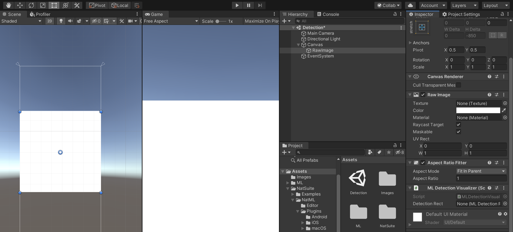

# ML Detection


This is a library for classifying images in Unity Engine using NatML. The following ML models are included:
- [TinyYOLO v3](https://github.com/onnx/models/tree/master/vision/object_detection_segmentation/tiny-yolov3)

## Setup Instructions
This package requires NatML, so make sure NatML is imported into your project. Then in your project's `Packages/manifest.json` file, add the following:
```json
{
  "dependencies": {
    "com.natsuite.ml.detection": "git+https://github.com/natsuite/ML-Detection"
  }
}
```

## Detecting Objects in an Image
First, assign the object detection model (in the `ML` folder) to an `MLModelData` field in your script:
```csharp
using NatSuite.ML;
using NatSuite.ML.Vision;

public class Classifier : MonoBehaviour {

    public MLModelData modelData; // Assign this in the Inspector
}
```

Then create a detection predictor corresponding to the model:
```csharp
void Start () {
    var model = modelData.Deserialize();
    var predictor = new TinyYOLOv3Predictor(model, modelData.labels);
}
```

Detect objects in an image:
```csharp
Texture2D image = ...;
(string label, Rect rect, float score)[] detections = predictor.Predict(image);
```

## Visualizing Detections
To visualize the detections, we will use Unity UI along with Visualizers included in NatML. First, create a UI `RawImage` to display our image. Then add an `MLDetectionVisualizer` component:



Next, we have to create a prefab rectangle that will be instantiated for every detected object. You can customize this as you desire, but for this example we will create a simple semi-transparent UI rectangle:


We need to add a UI text that will display the detected object's label:


Now, add an `MLDetectionRect` component to our prefab and assign the `Label Text` field:


Finally, assign the prefab to the `MLDetectionVisualizer` and disable it in the scene:


Now, we're ready to visualize detected objects. To do so, simply call the `Render` method on the visualizer:
```csharp
using System.Collections.Generic;   // For access to `List<>`
using NatSuite.ML.Visualizers;      // For access to `MLDetectionVisualizer`

MLDetectionVisualizer visualizer;   // Assign in Inspector

void Detect () {
    // Detect
    Texture2D image = ...;
    (string label, Rect rect, float score)[] detections = predictor.Predict(image);
    // Visualize
    var visualizations = new List<(Rect, string)>();
    foreach (var (label, rect, confidence) in detections) {
        var visualizationText = $"{label}: {confidence}";
        visualizations.Add((rect, visualizationText));
    }
    visualizer.Render(previewTexture, visualizations.ToArray());
}
```

## Requirements
- Unity 2019.2+
- NatML 1.0+

## Supported Platforms
- Android 7.0 Nougat or newer (API level 24+)
- iOS 13+
- macOS 10.15+
- Windows 10 64-bit

## Quick Tips
- See the [NatML documentation](https://docs.natsuite.io/natml).
- Join the [NatSuite community on Discord](https://discord.gg/y5vwgXkz2f).
- Discuss [NatML on Unity Forums](https://forum.unity.com/threads/open-beta-natml-machine-learning-runtime.1109339/).
- Contact us at [hi@natsuite.io](mailto:hi@natsuite.io).